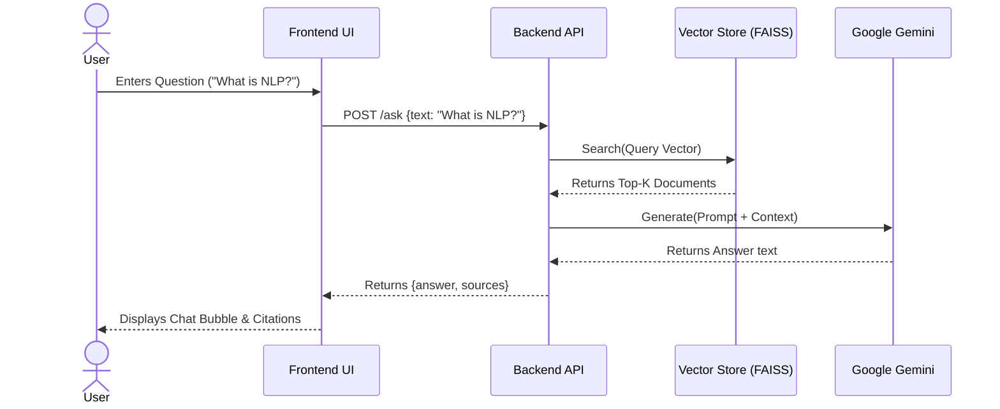
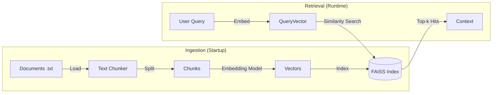

# NLPAssist+ Project Report

**Department**: FEST | **Program**: BS (AI)  
**Course**: Natural Language Processing (NLP)  
**Project**: Complex Computing Problem (CCP)

---

## 1. Introduction

### Objective and Goals
The primary objective of **NLPAssist+** is to develop an intelligent, LLM-powered Question Answering system using Retrieval-Augmented Generation (RAG). The system aims to provide students and faculty with accurate, context-aware answers to natural language queries by retrieving information from a specific set of documents (such as university policies, FAQs, or course outlines) rather than relying solely on the general knowledge of a language model.

### Problem Domain
In university environments, students often face conflicting or scattered information regarding policies, course content, and administrative procedures. Finding specific answers requires searching through multiple PDF/Word documents or webpages. NLPAssist+ solves this by allowing users to ask natural language questions (e.g., "What is the policy for late assignment submission?") and receiving instant, cited answers derived directly from the official document set.

---

## 2. Designed Model / Architecture

### System Architecture Diagram
The system is built on a client-server architecture. The Frontend (Client) communicates with the Backend (Server) via a REST API. The Backend manages the RAG pipeline and interacts with the external LLM provider.

```mermaid
graph TD
    Client[Frontend (React/Vite)] -->|HTTP POST /ask| API[Backend API (FastAPI)]
    API -->|Query| RAG[RAG Pipeline]
    
    subgraph "Backend System"
        RAG -->|1. Search| VectorDB[(FAISS Vector Store)]
        VectorDB -->|2. Retrieved Chunks| RAG
        RAG -->|3. Prompt + Context| LLM_Interface[Gemini Client]
    end
    
    LLM_Interface -->|4. Generate API Call| ExternalLLM[Google Gemini API]
    ExternalLLM -->|5. Generated Answer| LLM_Interface
    LLM_Interface -->|Answer + Sources| API
    API -->|JSON Response| Client
```

### Data Flow Diagram
This diagram illustrates the flow of data from the user's question to the final response.



### RAG Pipeline Diagram
Detailed view of the ingestion and retrieval process.



---

## 3. Methodology

### Tools and Libraries Used
*   **LLM Model**: `gemini-2.5-flash` (via Google Generative AI API).
*   **Embeddings**: `sentence-transformers/all-MiniLM-L6-v2` (Local, Open Source).
*   **Vector Database**: `FAISS` (Facebook AI Similarity Search) - In-memory version.
*   **Backend Framework**: `FastAPI` (Python).
*   **Frontend Framework**: `React` with `Vite` and `TailwindCSS`.

### Step-by-Step Implementation

#### 1. Document Preprocessing & Chunking
*   **Goal**: Prepare raw text for the AI.
*   **Method**: The system loads text files from the `backend/data/` directory. It splits the content using a simple paragraph-based strategy (splitting by double newlines `\n\n`) to ensure that semantic units (like a full answer or paragraph) remain intact.
*   **Code Reference**: `rag.py` → `ingest_documents()` function.

#### 2. Embedding Creation and Indexing
*   **Goal**: Convert text to machine-readable vectors.
*   **Method**: The system uses the `SentenceTransformer` library to pass each text chunk through the `all-MiniLM-L6-v2` model. This results in a 384-dimensional vector for each chunk. These vectors are added to a `faiss.IndexFlatL2` index for efficient Euclidean distance search.

#### 3. Retrieval and Prompt Construction
*   **Goal**: Find relevant info and prepare the LLM.
*   **Method**: When a query arrives, it is converted to a vector. We query the FAISS index to get the Top-3 closest chunks. A prompt is constructed templated as:
    > "You are a helpful assistant... Use the following context to answer... Context: [Chunk 1] [Chunk 2]..."

#### 4. Answer Generation and Returning Sources
*   **Goal**: Generate a natural language response.
*   **Method**: The full prompt is sent to Google's Gemini API. 
    *   **Generation Parameters**: We use `top_p=0.9`, `top_k=40`, and `temperature=0.7` to balance answer creativity with factual adherence to the context.
    *   The system uses an expanded dataset of ~60+ Q/A pairs to provide comprehensive coverage.
*   The response text is captured, and filenames of the Top-3 chunks are collected as "sources". Both are sent back to the frontend JSON response.

### Security and Caching Strategy
*   **Security**:
    *   API Keys (Gemini) are managed via environment variables (or secure config), never exposed to the client.
    *   The backend validates input to ensure non-empty queries to prevent wasted API calls.
*   **Caching**:
    *   **Vector Cache**: The embeddings are computed once on startup and held in RAM (FAISS). This avoids re-computing embeddings for the documents every time a user asks a question, providing instant retrieval speed.

---

## 4. Result and Discussion

### Screenshots
*(Please insert screenshots of your running application here for the submission)*

1.  **Chat Interface**: Shows the clean UI with input bar.
    *   *[Insert Screenshot 1]*
2.  **QA Example**: Shows a question, the AI answer, and the "Sources" list below it.
    *   *[Insert Screenshot 2]*
3.  **Validation**: Shows the system handling a query where context is found vs. not found.
    *   *[Insert Screenshot 3]*

### Discussion
*   **Quality of Answers**: The system provides high-quality, factual answers because the `all-MiniLM-L6-v2` embeddings effectively retrieve the correct context, and the Gemini models are very capable at synthesis. The constraint to "say I don't know" prevents hallucinations on unknown topics (unless disabled for general chat).
*   **Performance**:
    *   **Retrieval**: Extremely fast (<50ms) due to local, in-memory FAISS.
    *   **Generation**: Dependent on Gemini API latency, usually 1-2 seconds.
    *   **Startup**: Fast (~5-10 seconds) to ingest small-to-medium datasets.
*   **Security Considerations**: The current implementation is secure for a prototype. For production, we would add User Authentication (OAuth/JWT) and Rate Limiting to prevent API quota abuse.

---

## 5. CCP Attributes Mapped

### WP1 – Range of Conflicting Requirements
We balanced **Accuracy vs. Speed** by using a lightweight embedding model (speed) with a powerful cloud LLM (accuracy). We balanced **Local Resources vs. Model Size** by keeping the vector store in RAM (lightweight for small data) rather than requiring a heavy Docker container for a full Vector DB.

### WP2 – Depth of Analysis Required
The project required analyzing the trade-offs between different chunks sizes (paragraph vs fixed-size) and selecting the right prompt engineering strategy to ensuring the LLM respects the retrieval context.

### WP3 – Depth of Knowledge Required
The implementation demonstrates knowledge of the full modern NLP pipeline:
1.  **Text Preprocessing** (Cleaning/Chunking)
2.  **Vector Space Models** (Embeddings)
3.  **Approximate Nearest Neighbor Search** (FAISS)
4.  **Generative AI Integration** (Prompt Engineering/API)
